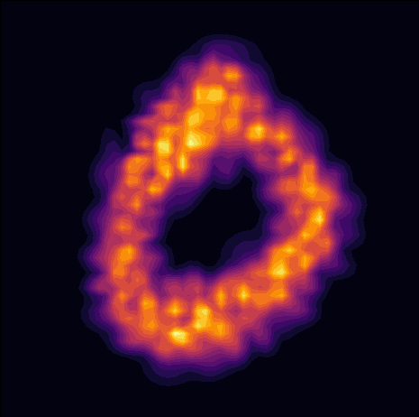
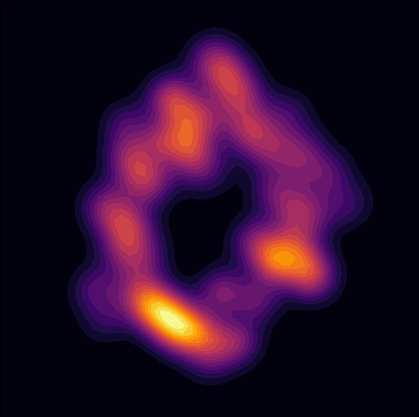

# Sliced Wasserstein Distances for Gaussian Mixture Models

This repository provides PyTorch-based implementations of sliced Wasserstein-type distances between Gaussian Mixture Models (GMMs). These metrics are useful for comparing distributions in high-dimensional spaces.
Check out our preprint [(Piening and Beinert, 2025)](preprint) for details! We would also like to point out our main reference [(Delon and  Desolneux, 2021)](https://epubs.siam.org/doi/abs/10.1137/19M1301047) 
for additional information.

## Features

- 📐 **MSW (Mixture Sliced Wasserstein)**: (Partially) Sliced Wasserstein-type distance for high-dimensional GMMs.
- 📏 **DSMW (Double Sliced Mixture Wasserstein) or SMSW (Sliced Mixture Sliced Wasserstein)**: Fully Sliced Wasserstein-type distance for high-dimensional GMMs with many components.
- ⚡ **Parallel & Vectorized Implementations**: Fast, differentiable versions of DSMW (SMSW) and MSW
- 🧮 **Support for Full and Diagonal Covariances**: Easily generate and manipulate random or structured GMMs.

## Contents

### Core Modules

- `sliced_mw.py`:  
  - Implements `calc_MSW`, `calc_SMSW`, `calc_parallel_SMSW` for sliced mixture Wasserstein distances
  - Projection utilities: `project_mu`, `project_sigma`, `project_gmm_1d`

- `gmm_utils.py`:  
  - `GaussianMixtureModel` class with sampling and conversion support
  - Utility functions for matrix operations: `nearest_psd`, `get_cholesky`, `generate_random_covariances`
 
- `ImageGMM.py`:  
  - Get GMMs based on MNIST for GMMBarycenter_GMMQuantization.ipynb

### Dependencies

- `torch`
- `numpy`
- `POT` (Python Optimal Transport) – `pip install POT`
- `scipy`, `joblib`, `scikit-learn`

## Example Usage

```python
import torch
import sliced_mw as smw
import gmm_utils as GMM

# Define two simple 2D GMMs with 10 components
K = 10
D = 2
gmm1 = GMM.RandomGaussianMixtureModel(K, D, device="cpu")
gmm2 = GMM.RandomGaussianMixtureModel(K, D, device="cpu")

# Compute sliced mixture Wasserstein distance
DSMW_distance = smw.calc_parallel_SMSW(gmm1, gmm2, pnum=1000) # SMSW=DSMW
print(f"SMSW Distance: {DSMW_distance.item():.4f}")
MSW_distance = smw.calc_MSW(gmm1, gmm2, pnum=1000) # SMSW=DSMW
print(f"MSW Distance: {MSW_distance.item():.4f}")

```

## Experiments

- ComputationTime.ipynb: Measure computation time
- ClusterDetection.ipynb: Detect ideal number of GMM cluster
- PerceptualGMMOT.ipynb: Use our sliced metrics for perceptual evaluation based on the framework presented in [Luzi et al., 2023](https://openaccess.thecvf.com/content/WACV2023/papers/Luzi_Evaluating_Generative_Networks_Using_Gaussian_Mixtures_of_Image_Features_WACV_2023_paper.pdf)
- GMMBarycenter_GMMQuantization.ipynb: Gradient descent on GMMs for barycenter and component reduction

### Example of Quantization Result

| Density of Input 2d GMM | Density of Reduced 2d GMM |
|:-----:|:-------:|
|  |  |


## Notes

- All distances are computed with squared Wasserstein-2 metrics unless noted otherwise.
- Parallelized variants (`calc_parallel_*`) are faster and fully differentiable.


## Citation

```bibtex
@article{piening2025sliced,
  title={XXX},
  author={Piening, Moritz and Beinert, Robert},
  journal={XXX},
  year={2025}
}
```

## License

MIT License
